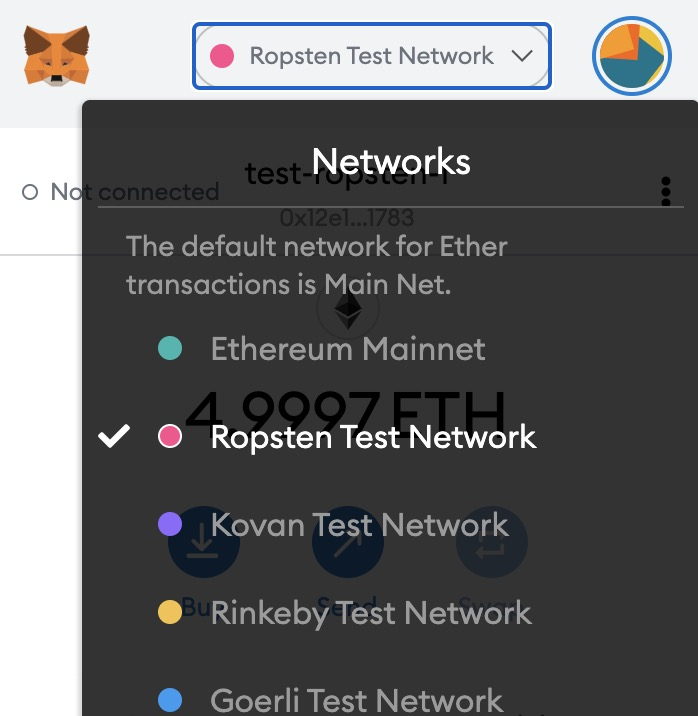
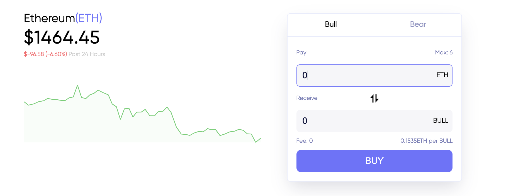
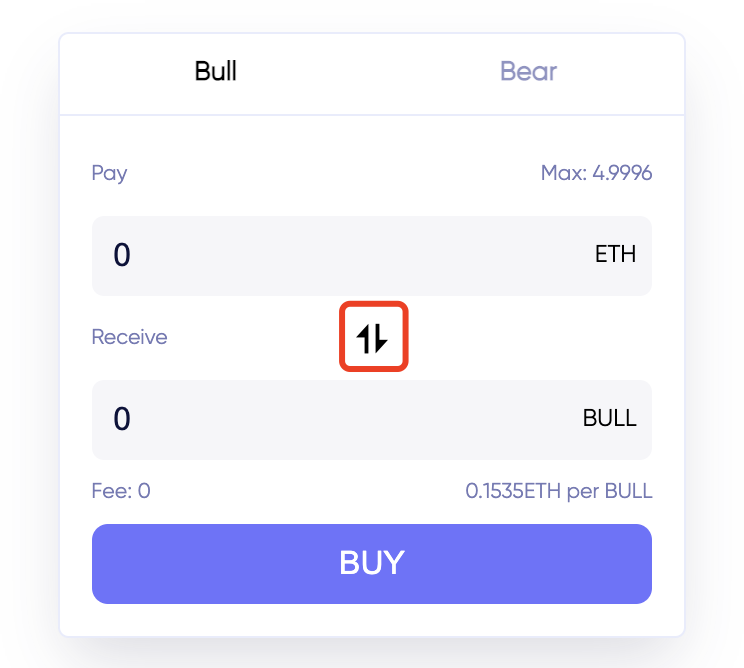

*LevSwap testnet participation tutorial*

**You will need**

* Browser [Google Chrome](https://www.google.com/chrome/)
* Wallet [MetaMask](https://chrome.google.com/webstore/detail/metamask/nkbihfbeogaeaoehlefnkodbefgpgknn)
* 10-15 minutes

### Step 1: Install [Google Chrome](https://www.google.com/chrome/) browser

### Step 2: Install Metamask wallet

If you have not installed metamask before, go to [Metamask.io](https://metamask.io/download.html) and download the Metamask browser extension, and create your first Ethereum address. If you use this newly created wallet in the future, pay attention to properly back up the mnemonic phrase.

### Step 3: Switch to Ropsten testnet and get some Ropsten ETH

* Click on the network in the metamask and switch to the Ropsten network

  

* Receive test ETH (rETH) 

The following are two addresses for receiving Ropsten testnet eth, and you can receive 1 or 5 respectively. After obtaining the Ethereum address from the previous step, copy it and paste it into the following website to obtain it. You can only claim it once a day. (Note that the network is switched to **Ropsten Testnet** in the metamask)

1 rETH: https://faucet.ropsten.be/

5 rETH: https://faucet.dimensions.network/

 

### Step 4: Log in to levswap and trade leveraged tokens

LevSwap Eth leveraged token trading address: http://levswap.com/app/eth/usdt

In the testnet stage, we provided ETH 3 times short and 3 times long capabilities.

When you open the website, you will be prompted to connect to your metamask wallet, select the corresponding address in the metamask to connect.

 

The current ETH spot price is displayed on the left side of the page,  You can do long or short  judgment based on this:

#### Buy in

* If you decide to **Long** ETH: Choose Bull, fill in the amount of ETH you want to use to buy Bull tokens, the system will base on the current Bull price (calculated from the number of eth in the bull pool and the number of bulls), displays the number of Bulls that can be purchased, click the Buy button to purchase.

* If you decide to **Short** ETH: select Bear, fill in the amount of ETH you want to use to buy Bear tokens, the system will base on the current Bear price (calculated by the number of eth in the bear pool and the number of bears) , Show the number of Bears that can be purchased, click the Buy button to purchase.

After clicking to buy, metamask will pop up a purchase confirmation box. After clicking confirm, wait for the test network to confirm. The transaction result (success or failure) will be prompted by a popup box.

 After the purchase is successful, the balance of the token will be displayed in the upper right corner of the relevant asset input box. (If it is not displayed, please refresh the page and try).

#### Sell

When you want to close your position, click the exchange symbol between the two quantity input boxes, fill in the quantity you want to close in the Bull or Bear input box, click Sell, metamask will pop up a purchase confirmation box, click After confirmation, wait for the testnet to confirm.

