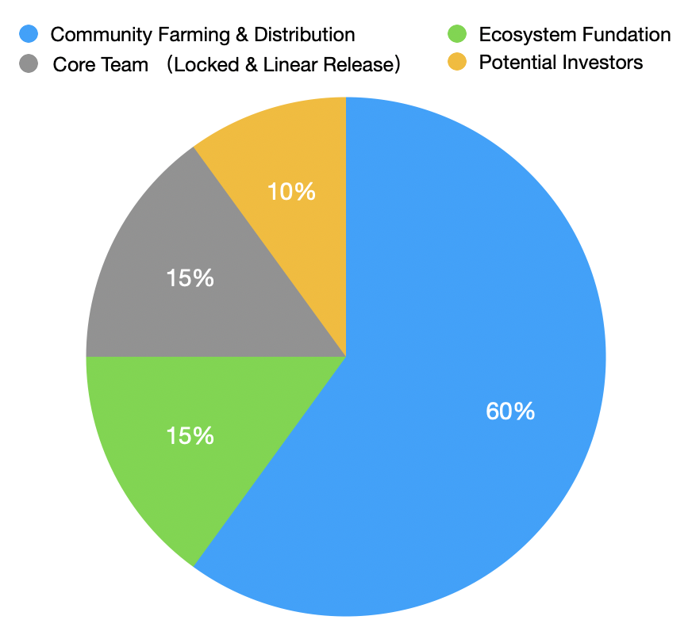

# $LEV Token

## Token Allocation

$LEV is LevSwap's protocol governance Token, with a total of 100 million (100,000,000). The allocation plan is as follows.

* Community distribution & mining: 60%, a total of 60,000, 000.
  50% distributed in the first 3 years, the remaining 10% as long-term incentives. Among them, 20% of the total Tokens distributed in the first year, 15% in the second year, 15% in the third year, and 10% in the fourth year and beyond, the distribution ratio of the community mining part:
  - Proof-of-Liquidity-Mining (30% of total tokens)

  - Transaction is mining Proof-of-TransFee (20% of total tokens)

  - Locked Staking and other Bonus mining (10% of total tokens)

* Core team: 15%, locked and linearly released, a total of 15,000, 000. It will be locked for one year since it was launched, and distributed from the second year. 5% of the total tokens will be distributed every year until the end of the fourth year.
* Ecological incentive fund: 15%, locked and linearly released, a total of 15,000, 000. It is mainly used for community developer incentives, technical community construction. The allocation of funds will be based on community governance. 50% will be distributed in the first 3 years, and the remaining 10% will be used as long-term incentives. Among them, 20% of the total tokens distributed in the first year, 15% in the second year, 15% in the third year, and 10% in the fourth year and beyond.
* Potential investors: 10%, a total of 10,000, 000, the lock-up and distribution rules are consistent with the core team.

## Token Utility Scenarios
As the native token of LevSwap, LEV represents the rights of the holders, and it also has it's utility value. It can be used in the following scenarios.

- Community governance
  As a community-led decentralized project, LEV is a certificate of community participation in governance:
  - Users with LEV can initiate proposals for function upgrades, parameter modifications (such as handling fees, mining distribution ratios), product development routes, etc.
  - Users with LEVs can vote on proposals. Proposals with a majority of votes will be approved and the project team is responsible for implementation.
- Vote / Pledge for listing
    As a leveraged token DEX that supports multiple asset targets, we will support the listing of more synthetic assets in the future. LEV holders can vote on the listing and the establishment of liquidity pools. Putting on the shelf is implemented by the project team.
- Revenue Buy-back
    LevSwap will charge a 0.3% handling fee for the transaction, of which 0.25% is automatically allocated to the liquidity provider, 0.05% is used as the agreement handling fee, and the agreement handling fee 100% is used for regular repurchase of LEV and directly destroyed. That is, 100% of the handling fee will be fed back to the ecological parameter holders and LEV holders.

## Community Distribution & Mining

60% of the governance tokens in LevSwap will be distributed to our protocol users. Community mining is divided into liquid mining and transaction mining. The liquidity provider optimizes the trading experience of the LevSwap protocol and will be rewarded with LEV governance tokens. In addition, all users participating in LevSwap transactions will be rewarded with LEV governance tokens.

**a. Liquidity Mining**
LevSwap liquidity mining rewards are divided into two parts. One part is used to incentivize users who provide liquidity for the LEV/ETH trading pair on Uniswap; the other part is used to incentivize users who provide liquidity for the LevSwap leveraged token pool. The liquidity provider provides a smooth trading experience for LEV Token and LevSwap leveraged tokens, and will be rewarded by the LevSwap protocol.
The LevSwap liquidity mining plan, for users who provide LEV/ETH liquidity on Uniswap, will be launched immediately after the Token is officially launched. For the liquidity incentives of leveraged token pools, analogous to Uniswap liquidity mining mechanism, the liquidity providers of certain leveraged token trading pairs will be incentivized. This part of the mining incentives will be after the LevSwap mainnet is launched. 2 Open within a week. Early support
The leveraged trading pool and reward ratio will be announced simultaneously when the mainnet is launched, and the follow-up will be jointly decided by the community.

**b. Trade Mining**
As an innovative decentralized exchange of leveraged tokens, LevSwap will allow more users to trade, which will bring greater value to the agreement. LevSwap has designed trading and mining to motivate users who participate in transactions. All users participating in LevSwap leveraged token transactions will receive LEV Token rewards based on the amount of transaction fees paid for their transactions. The reward will be calculated based on the ratio of the transaction fee of this user to the transaction fee of all users this week and the distribution of LEV this week. The more the user who pays the fee, the more LEV Token will be rewarded. 

**c. Smart Contract Staking**
In order to encourage users to hold LEVs for a long time, LevSwap has set up a staking lock-up mechanism, which will be launched simultaneously after the mainnet goes online. The staking lock-up mechanism is implemented by smart contracts, and there is no centralization risk. To participate in staking, users need to lock LEV into a designated smart contract. During staking, users can take away their own LEV at any time. When users participate in staking, they will lose 10% of staking funds, and when users withdraw from staking, they will also lose 10% of staking funds. The funds lost by users entering and exiting will be redistributed proportionally to all current stakeholders in the Staking contract. The purpose of this is to encourage long-term investors to stand firm.
And what rewards will users get during their participation in staking? The rewards for investors participating in staking are divided into two parts. The first part is the LEV funds paid by other users when entering and exiting the staking contract. This fund is used to reward the current staking user. This reward is distributed according to the proportion of the current user's investment funds in the total staking contract funds. The second part of the reward is the business handling fee for LevSwap leveraged token transactions. The business handling fee will be settled in a fixed cycle, and LEV Token will be repurchased in the market, and the repurchased LEV will be allocated to the Staking contract in proportion Of all participants.

## Summary
LEV is LevSwap's governance token,LEV is the key to incentivizing participants to build the LevSwap ecosystem. More than 60% of LEV will be fairly distributed to participants in the LevSwap community, and all LEV Tokens will be distributed within 4 years. At the same time, LEV Token holders can participate in LevSwap's ecological governance, proposals, and voting to build a prosperous LevSwap ecosystem.

